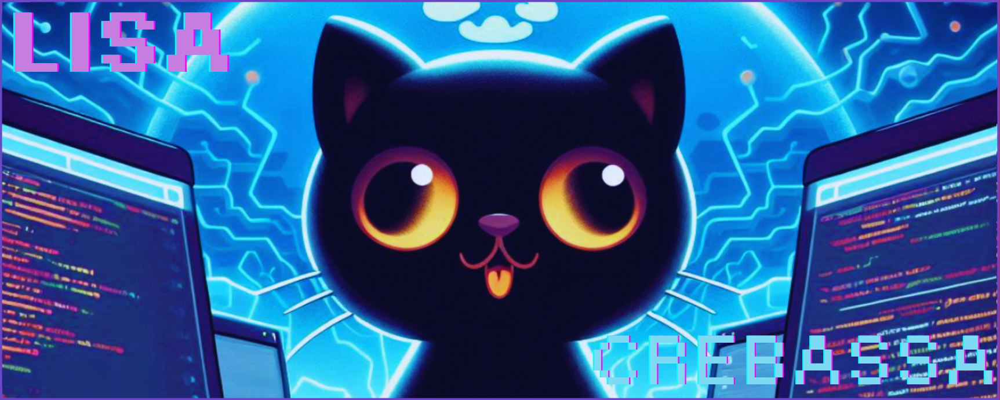
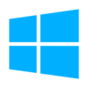

## Hi there, I'm Lisa Crebassa ! 👋

<!--
**lisacrebassa/lisacrebassa** is a ✨ _special_ ✨ repository because its `README.md` (this file) appears on your GitHub profile.

Here are some ideas to get you started:

- 🔭 I’m currently working on ...
- 🌱 I’m currently learning ...
- 👯 I’m looking to collaborate on ...
- 🤔 I’m looking for help with ...
- 💬 Ask me about ...
- 📫 How to reach me: ...
- ⚡ Fun fact: ...
-->
## 🚀 About Me
 My past experiences remains on the field of being a barmaid. Aside from projects directly coming from school, I learn on the side. Currently, I am working on pentestings, and correcting vulnerabilities. 

## 🔗 Links

